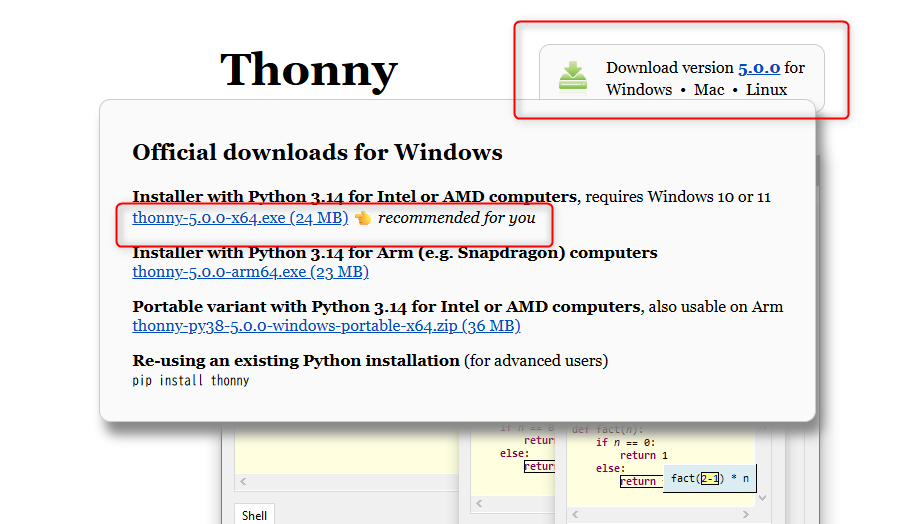
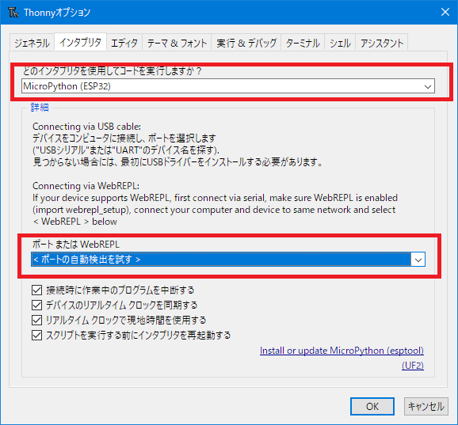
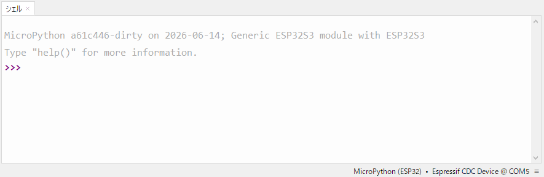

# 1: 環境構築 (Thonny インストール)

この章では、StampS3 にプログラムを書き込むための開発環境を準備します。

## 想定時間

10 分

## この章のゴール

- Thonny をインストールする
- StampS3 を PC に接続する
- MicroPython の書き込み先を確認する

## 手順の下書き

1. Thonny をインストールする  
   最初に PC でコードを編集して実行させるためのIDEが必要ですので、以下のThonnyをインストールします。

   [https://thonny.org/](https://thonny.org/)

   Thonnyは、エストニアのタルトゥ大学で開発された統合開発環境（IDE）です。Raspberry Pi PicoやM5Stackといった、MicroPythonを動かすためのマイコン制御に定評があります。

   サイトに遷移し、キャプチャの通り、OSに合わせたインストーラーをダウンロードしてインストールしてください。  
   ※本手順ではWindows版を利用しています。

   

2. StampS3 を USB ケーブルで接続する  
   StampS3 を USB ケーブルで PC に接続します。USB Type-C ケーブルを利用して、StampS3 の USB ポートと PC の USB ポートを接続してください。

3. Thonny を起動してインタープリタ設定を確認する  
   Thonnyを起動し、実行＞インタプリンタ設定を選択し、インタプリンタは```MicroPython(ESP32)```を選択します。ポートは<ポートの自動検出を試す>を選択します。  
   シリアルポートの番号は接続する PC や USB ポートの状況によって変わる可能性があるため、表示されている候補を確認してください。  
   これで、IDEを利用して StampS3へのコード書き込み、実行が可能になります。

   

4. サンプルコードを書き込める状態まで準備する  
   シェルに以下のように表示されていれば、ThonnyからStampS3にコードを書き込む準備ができています。

   

## 補足

- ここに OS ごとのインストール手順やスクリーンショットを追加予定
- 初回接続時の注意点があれば追記予定

---

- 次: [2: hello, world で L チカ](../chapter2/README.md)
