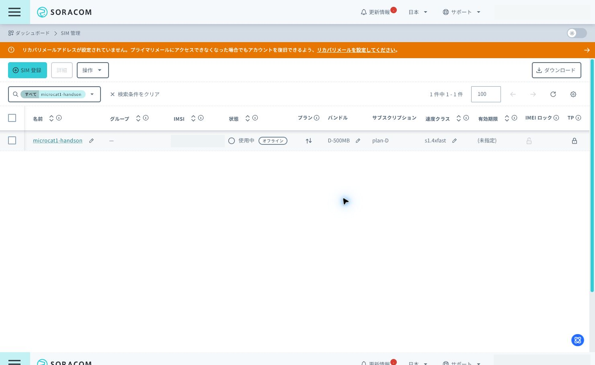
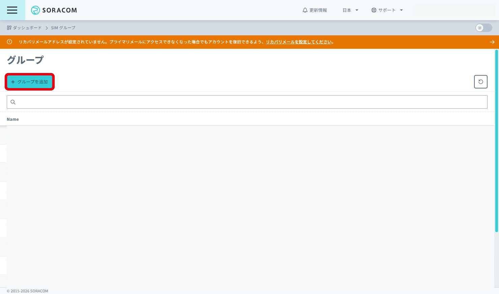
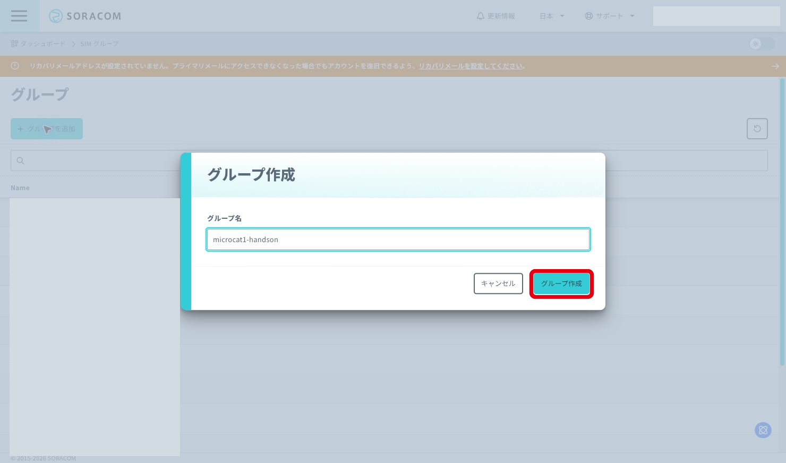
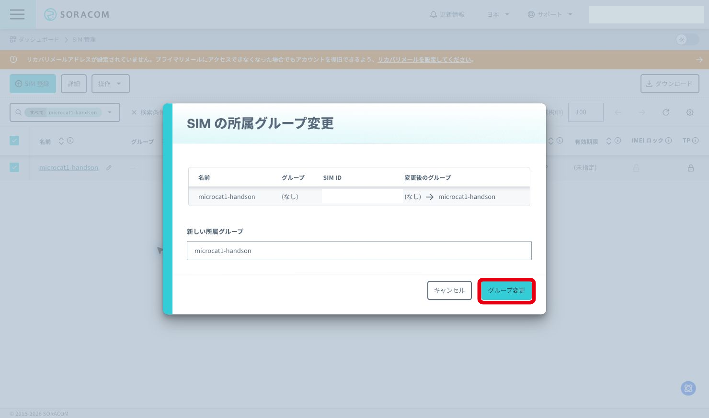
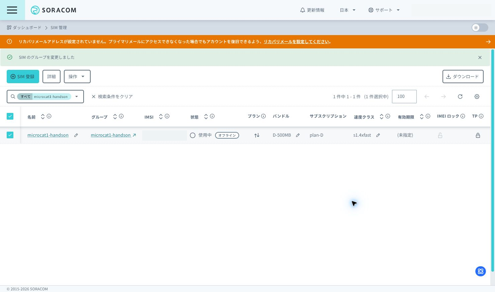
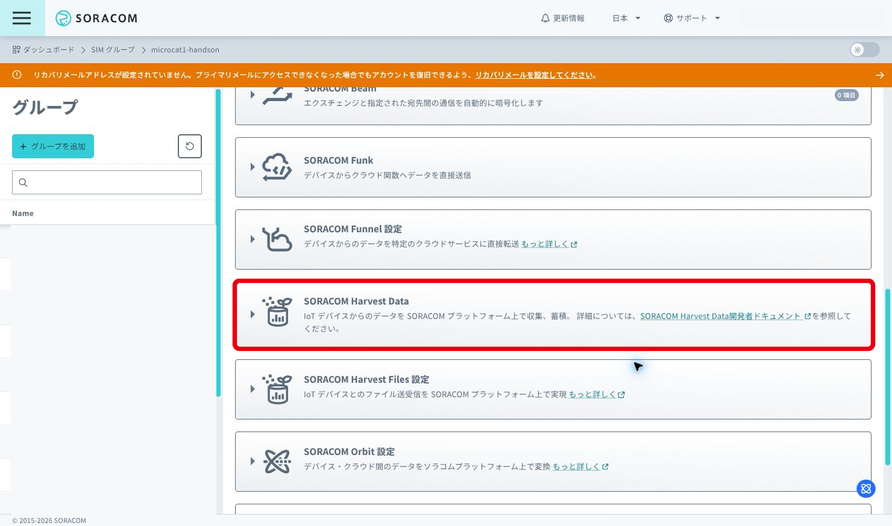
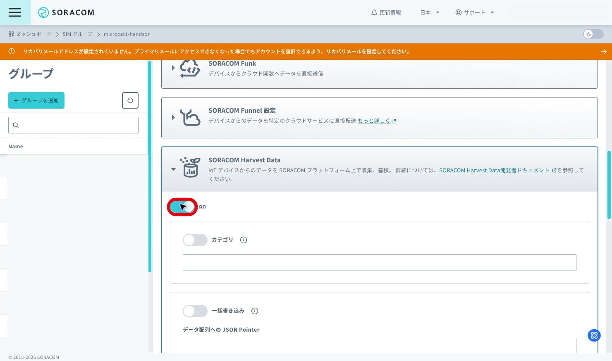
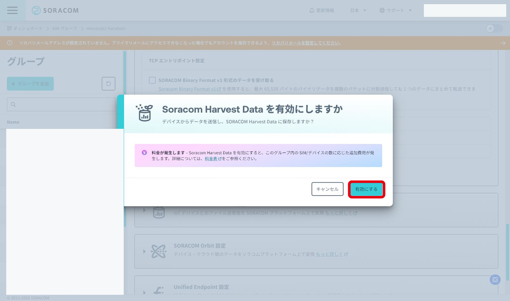
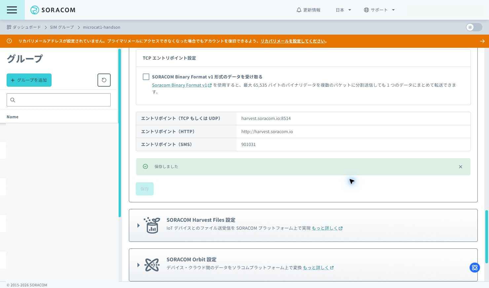
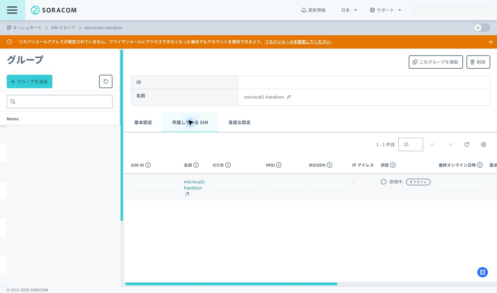

# 3: SIM の開通と SORACOM Harvest Data の設定

この章では、バーチャル SIM を SORACOM で作成にし、データ受け取り先として SORACOM Harvest Data を有効化します。

## 想定時間

10 分

アカウント作成と SIM 登録の作業時間は含みません。

## この章のゴール

- SORACOM ユーザーコンソールにログインできる
- バーチャル SIM が登録済みで、状態が `準備完了 (Ready)` になっている
- SIM をハンズオン用の SIM グループに所属させる
- SORACOM Harvest Data を ON にする

## 事前に用意するもの

- SORACOM ユーザーコンソールにログインできるアカウント

> [!IMPORTANT]
> SORACOM Arc と SORACOM Harvest Data は有償サービスです。
> このハンズオンでは、バーチャルSIMの初回発行無料枠を利用する想定です。
> ハンズオン後も設定や SIM を残しておくと、そのまま継続して利用できます。ただし、残し続けると課金が発生する場合があります。
> 継続利用しない場合の片付けは、全章の作業を終えたあとに別章でまとめて行います。

## 1. SORACOM アカウントを準備する

アカウント作成手順は、公式ドキュメントを参照してください。

- [STEP 1: SORACOM アカウント (オペレーター) を作成する](https://users.soracom.io/ja-jp/guides/getting-started/create-account/)

正しく完了している状態は、次のとおりです。

- [SORACOM ユーザーコンソール](https://console.soracom.io/) にログインできる
- オペレーター ID が発行されている
  - 例: `OP` で始まる 12 文字の ID
- カバレッジタイプで `Japan` を選択している
- 当日案内されたクーポンを適用している

このハンズオンでは、日本カバレッジの SIM を使います。
以降の作業は、SORACOM ユーザーコンソールでカバレッジタイプに `Japan` を選択した状態で進めます。

## 2. バーチャル SIM を登録する

SIM の登録手順は、公式ドキュメントの「SORACOM ユーザーコンソールでバーチャル SIM/Subscriber を作成する」を参照してください。

⚠⚠作業前の注意⚠⚠
「WireGuard の接続情報(秘密鍵)」は必ず安全なところに保存してください。
登録画面にも表示されますが、秘密鍵の表示は１度限りです!!
PCの再起動等で紛失しないよう記録してください。
再作成は有料になります。

- [プライマリサブスクリプションのバーチャル SIM/Subscriber を作成する](https://users.soracom.io/ja-jp/docs/arc/create-virtual-sim/#%e3%83%97%e3%83%a9%e3%82%a4%e3%83%9e%e3%83%aa%e3%82%b5%e3%83%96%e3%82%b9%e3%82%af%e3%83%aa%e3%83%97%e3%82%b7%e3%83%a7%e3%83%b3%e3%81%ae%e3%83%90%e3%83%bc%e3%83%81%e3%83%a3%e3%83%ab-simsubscriber-%e3%82%92%e4%bd%9c%e6%88%90%e3%81%99%e3%82%8b)

このハンズオンで使う SIM は、日本カバレッジのバーチャル SIM です。

正しく完了している状態は、次のとおりです。

- **SIM 管理** 画面に、登録したバーチャル SIM が表示されている
- 対象 SIM の `ID` が、登録した SIM の ID と一致している
- 対象 SIM の `状態` が `準備完了 (Ready)` になっている

> [!TIP]
> SIM を区別しやすくするため、SIM の `名前` に `StampS3-handson` などを設定しておくと、このあとの手順で対象 SIM を見つけやすくなります.

## 3. Harvest 用の SIM グループを作成する

左側のメニューから **SIM グループ** を開きます。
次の手順で、ハンズオン用のグループを新しく作成します。

1. **+ グループを追加** をクリックします
2. グループ名を入力します
   - 例: `StampS3-handson`
3. **グループ作成** をクリックします

作成したグループは、あとで SIM を所属させるときに選択します。

## 4. SIM をグループに所属させる

左側のメニューから **SIM 管理** を開きます。

1. ハンズオンで使う SIM にチェックを入れます
2. **操作** から **所属グループを変更** を選択します
3. **新しい所属グループ** で、手順 3 で作成したグループを選びます
4. **グループ変更** をクリックします

SIM 管理画面に戻り、対象 SIM の `グループ` に選択したグループ名が表示されていることを確認します。

## 5. SORACOM Harvest Data を有効化する

左側のメニューから **SIM グループ** を開き、手順 3 で作成したグループをクリックします。

1. **基本設定** タブを開きます
2. **SORACOM Harvest Data 設定** をクリックして設定項目を開きます
3. スイッチを `ON` にします
4. 今回は追加オプションを変更せず、初期設定のままにします
   - カテゴリ: 空欄のまま
   - 一括書き込み: OFF のまま
   - 送信データの時刻をタイムスタンプに利用する: OFF のまま
5. **保存** をクリックします
6. 確認画面が表示されたら内容を確認し、**有効にする** をクリックします

これで、このグループに所属している SIM から送信したデータを Harvest Data に保存できるようになります。

## 6. 設定できたことを確認する

次の 2 点を確認します。

- SIM 管理画面で、対象 SIM がハンズオン用グループに所属している
- SIM グループ画面で、対象グループの SORACOM Harvest Data 設定が `ON` になっている

確認できたら、この章は完了です。
次の章では MicroCat.1 からデータを送信し、Harvest Data に保存されることを確認します。

## FAQ

### SORACOM ユーザーコンソールにログインできない

アカウント作成が完了しているか確認してください。
アカウント作成手順は、[公式ドキュメント](https://users.soracom.io/ja-jp/guides/getting-started/create-account/) を参照します。

### SIM が見つからない

カバレッジタイプが `Japan` になっているか確認してください。
このハンズオンでは日本カバレッジの SIM を使います。

### Harvest Data を ON にしたのにデータが表示されない

この章では Harvest Data の受け取り先を準備しただけです。
実際のデータ送信と表示確認は次の章で行います。

### 料金が気になる

当日の作業分は、無料枠を利用する補填する想定です。
ハンズオン後に設定を残して継続利用する場合は、SORACOM Arcや SORACOM Harvest Data の料金が発生する場合があります。
継続利用しない場合の片付けは、全章の作業を終えたあとに別章でまとめて行います。

## 参考ドキュメント

- [SORACOM アカウント (オペレーター) を作成する](https://users.soracom.io/ja-jp/guides/getting-started/create-account/)
- [SORACOM ユーザーコンソールでバーチャル SIM/Subscriber を作成する](https://users.soracom.io/ja-jp/docs/arc/create-virtual-sim/)
- [グループを作成する](https://users.soracom.io/ja-jp/docs/group-configuration/create-group/)
- [IoT SIM、LoRaWAN デバイス、Sigfox デバイスが所属するグループを切り替える](https://users.soracom.io/ja-jp/docs/group-configuration/set-group/)
- [SORACOM Harvest Data を有効化する](https://users.soracom.io/ja-jp/docs/harvest/enable-data/)

---
- 次: [4: SORACOM へデータ送信して Harvest で確認](../chapter4/README.md)
- 前: [2: hello, world で L チカ](../chapter2/README.md)
