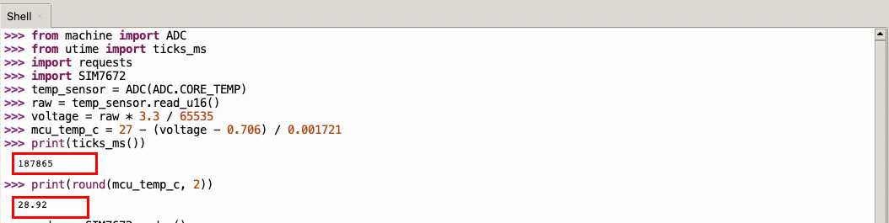
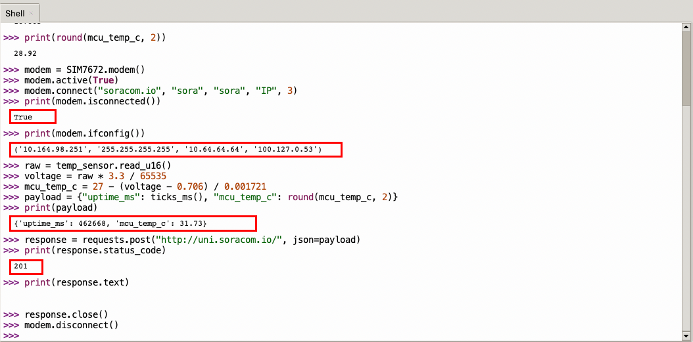
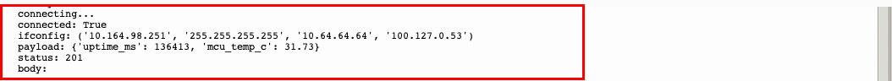
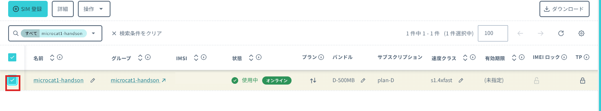
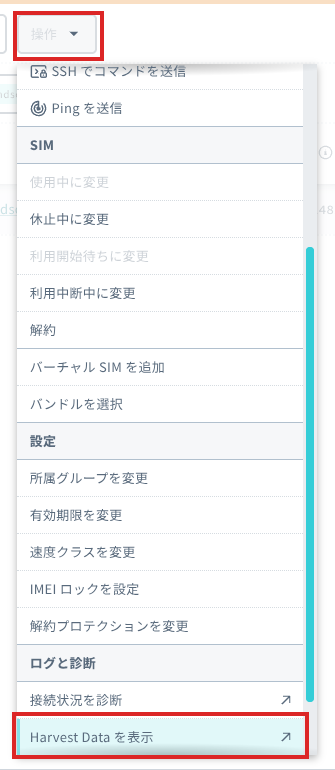
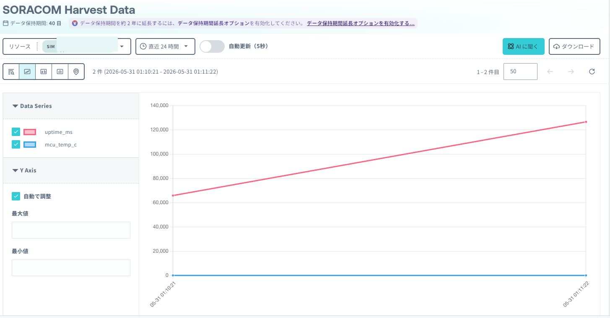

# 4: SORACOM へデータ送信して Harvest で確認

この章では、StampS3 から SORACOM へデータを送信し、Harvest で受信結果を確認します.

## 想定時間

10 分

## この章のゴール

- StampS3 からバーチャルSIMでデータを送る
- Harvest Data 上で受信したデータを確認する
- 送信内容と表示内容の対応を理解する

## 事前に確認すること

この章では、前の章で設定した SIM グループを使います。次の状態になっていることを確認してください。

- インターネットに接続できるWifiがある
- WireGuard 拡張入りファームウエアが書き込まれたStampS3がある
- WireGuard の接続情報(秘密鍵)がある
- SIM が所属するグループで SORACOM Harvest Data が ON になっている
- Thonny から StampS3 にプログラムを実行できる

## 送信するデータ

この章では、外付けセンサーの値ではなく、StampS3 の内部で取得できる値を送信します。

| 項目 | 内容 |
| --- | --- |
| `uptime_ms` | プログラム実行時点の起動後経過時間です。 |

`uptime_ms`  は、どちらも外付けセンサーを使わずに StampS3 の内部で取得できる値です。

## REPL で 1 つずつ確認する

まずは Thonny の REPL で、各コードブロックの内容を上から 1 行ずつ入力します。どこまで成功しているか確認しながら進めます。

### ライブラリを読み込む

```python
from machine import ADC
from utime import ticks_ms
import requests
```

エラーが表示されなければ次に進みます。

### 内部データを取得する

```python
print(ticks_ms())
```

数値が表示されれば、内部データを取得できています。



### Wifiに接続する

【SSID】と【パスワード】を書き換えてから実行してください

```python
import network
wlan = network.WLAN(network.STA_IF)
wlan.active(True)
wlan.connect('【SSID】', '【パスワード】')
```

接続状態を確認します。

```python
print(wlan.isconnected())
```

`False` が表示された場合は、数秒待ってから同じ行をもう一度実行します。`True` が表示されたら IP アドレスなどを確認します。

```python
print(wlan.ifconfig()[0])
```

`print(wlan.isconnected())` で `True`、`print(wlan.ifconfig()[0])` で IP アドレスなどが表示されれば、セルラー通信の準備ができています。


### バーチャルSIMを接続する

時刻設定をします。

```python
import ntptime
import time
ntptime.server = 'ntp.soracom.io'

ntptime.settime()
```

時刻を確認します。現在時刻が表示されてることを確認してください。
```python
print(time.localtime())
```

WireGuard接続をします。
【PrivateKey】【Address】【PublicKey】【port】を書き換えてから実行してください

||キーワード引数|WireGuard の接続情報|補足|
|---|---|---|---|
|①|local_ip|Address|そのまま|
|②|private_key|PrivateKey|そのまま ※base64|
|③|remote_peer_address|Endpoint|分解して「IP アドレスまたはホスト名」部分を使用|
|④|remote_peer_public_key|PublicKey|そのまま ※base64|
|⑤|remote_peer_port|Endpoint|分解して「ポート番号」部分を使用|
AllowedIPsは使用しません。全部SORACOM向きになります。

※remote_peer_addressはおそらく固定なので書き換え対象としていません。

```python
import wireguard
result = wireguard.begin(local_ip='【Address】',private_key='【PrivateKey】',remote_peer_address='beck.arc.soracom.io',remote_peer_public_key='【PublicKey】',remote_peer_port=【port】)
```

接続状態を確認します。

```python
import requests
response = requests.get("http://metadata.soracom.io/v1/subscriber")
print(response.status_code)
response.text
response.close()
```

200や名前などが表示されれば、セルラー通信の準備ができています。

### Harvest Data に送信する

送信するデータを作ります。

```python
payload = {"uptime_ms": ticks_ms()}
print(payload)
```

Unified Endpoint に送信します。

```python
response = requests.post("http://uni.soracom.io/", json=payload)
print(response.status_code)
print(response.text)
response.close()
```

`201` が表示されれば、SORACOM Harvest Data にデータが保存されています。`response.text` が空でも問題ありません。

最後に接続を終了します。

```python
wireguard.end()
```



## コードとして保存する

REPL で確認できたら、同じ処理を 1 つのコードとして保存します。

Thonny で新しいファイルを作成し、次のコードを貼り付けます。その後、StampS3 に `main.py` としてアップロードして実行します。

```python
from utime import sleep, ticks_diff, ticks_ms
import requests
import network
import ntptime
import time
import wireguard

wlan = network.WLAN(network.STA_IF)
wlan.active(True)
wlan.connect('【SSID】', '【パスワード】')

ntptime.server = 'ntp.soracom.io'
ntptime.settime()

sleep(1)
result = wireguard.begin(local_ip='【Address】',private_key='【PrivateKey】',remote_peer_address='beck.arc.soracom.io',remote_peer_public_key='【PublicKey】',remote_peer_port=【port】)

meta_res = requests.get("http://metadata.soracom.io/v1/subscriber")
print("metadata status:", meta_res.status_code)
meta_res.close()

try:
    started_at = ticks_ms()
    payload = {
        "uptime_ms": ticks_ms()
    }
    print("payload:", payload)

    response = requests.post("http://uni.soracom.io/", json=payload)
    print("status:", response.status_code)
    print("body:", response.text)
    response.close()
finally:
    wireguard.end()
```

## 実行結果を確認する

実行ログで次の点を確認します。

- `metadata StatusCode:: 200` が表示される
- `payload:` に `uptime_ms` とが表示される
- `status: 201` が表示される

`status: 201` が表示されれば、SORACOM Harvest Data にデータが保存されています。`body:` の後ろが空でも問題ありません。



## Harvest Data で確認する

SORACOM ユーザーコンソールで `SIM 管理` を開き、対象の SIM にチェックを入れます。



`操作` をクリックし、メニューを下へスクロールして `ログと診断` の `Harvest Data を表示` をクリックします。



Harvest Data の画面が開きます。グラフ表示や表示範囲の変更など、詳しい画面操作は [Harvest Data のデータを確認する手順](https://users.soracom.io/ja-jp/docs/harvest/visualize/) を参照してください。



`Data Series` に `uptime_ms` と が表示され、グラフまたはテーブルで値を確認できれば成功です。

## FAQ

### `status: 201` が表示されない

SIM が所属するグループで SORACOM Harvest Data が ON になっているか確認してください。あわせて、バーチャルSIM の状態、Wifiの接続、電波状況も確認します。

### Thonny の接続が切れた

Thonny のメニューから `Run` -> `Stop/Restart backend` を選択して、StampS3 に再接続します。Shell に `>>>` が表示されれば再開できます。

### Harvest Data にデータが表示されない

対象の バーチャルSIM を選んでいるか確認してください。表示されない場合は、画面を再読み込みしてからもう一度確認します。

## 参考

---
- 次: [5: センサーをつないでみる](../chapter5/README.md)
- 前: [3: SIM の開通と SORACOM Harvest Data の設定](../chapter3/README.md)
