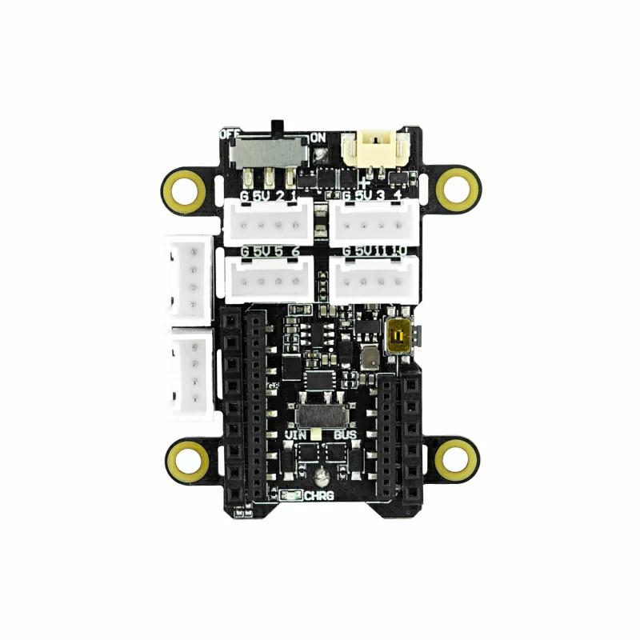
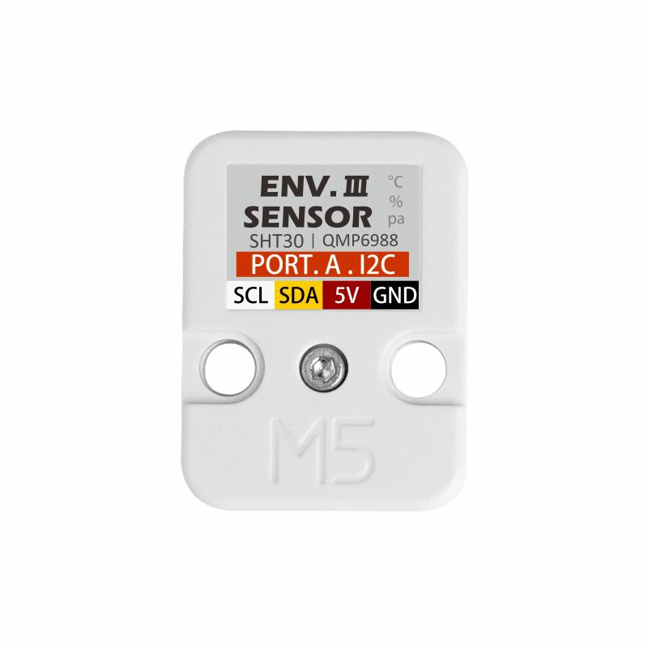

# 5: センサーをつないでみる

早めに完了した人向けの追加コンテンツです。外部センサーを接続し、取得した値を送信してみます。

## この章のゴール

- ライブラリでセンサーからデータを取得する
- 取得したセンサーデータを StampS3 から送信する
- 送信結果を Harvest で再確認する

今回利用するセンサーは、いずれもGroveという規格のコネクタを使用しているため、Grove コネクタを持つセンサーシールドやブレイクアウトボードを使用して接続することができます。例えばSORACOMのオンラインストアで販売されている「Wio BG770A」というマイコンはGroveコネクタを持っていて、このセンサー類を接続することが出来ます。

StampS3にはGroveコネクタがないため、今回はブレイクアウトボードを利用します。

## 1. GroveBreakOut

ブレイクアウトボードをつないでみましょう



StampS3の端子側が外側になるよう上からはめます。  
ピンが刺さることを確認しながら行ってください。  
さほど、力を入れる必要はありません。  


## 2. 温湿度センサー

### 物理接続
温湿度センサーを繋いでみましょう。



StampS3の左下のコネクタに接続します。  
ケーブルの向きは爪で、逆には刺さらないようになってます。  
裏側から見ると15,13,5V,Gと印刷されてます。  


StampS3では、I2C（通信方法の1つ）のデフォルトはGPIO 15,13です。こちらで同通信に対応したセンサーデータを取得することができます。以下のコードを貼り付けてみてください。  
Tips:ソフトI2CだとどのGPIOでも使えるらしい。すごいですね！

### ドライバーのダウンロード

MicroPythonでは、pipに似たパッケージシステムでmipという物があります。  
今回、このセンサーの温湿度のドライバーに当たるパッケージをあらかじめ用意してあります。  
wifiに接続した後、Thonny の REPL に以下を入力してください。  

```python
import mip
mip.install('github:tac-yacht/m5unit_env3')
```

※電源のオンオフでは消えません。基本的には１度限りでおｋです。ファームウェアを更新したりすると消えます。

### 温湿度の取得

```python
from m5unit_env3 import ENV3
env3 = ENV3()
 
while True:
    try:
        result = env.read_temp_and_humi()
        print("Temp:", result.temperature, "C, Humi:", result.humidity, "%")

    time.sleep(2)
```

センサーが正しく動作していれば、コンソールに2秒ごとに温度と湿度が表示されます。センサー部分を指で暖めたりすると数値が変わるのが分かります。  

正常に取得できたら、chapter4のプログラムと組み合わせて、このデータをSORACOMへ送信してみましょう。


---
- 次: [6: あとかたづけと注意事項](../chapter6/README.md)
- 前: [4: SORACOM へデータ送信して Harvest で確認](../chapter4/README.md)
