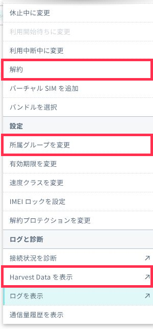
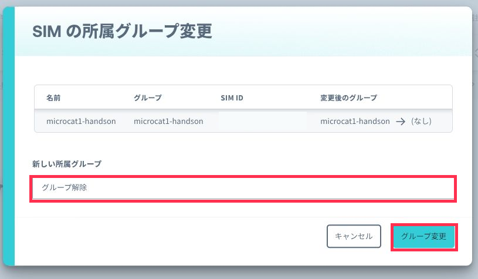
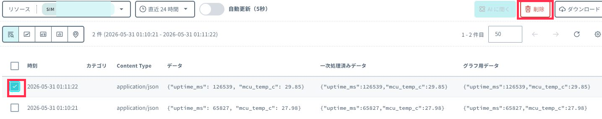
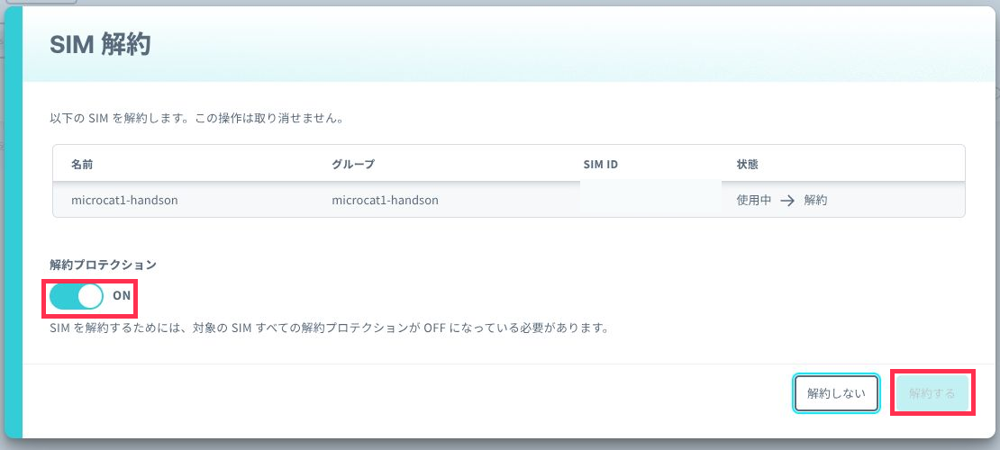

# 6: あとかたづけと注意事項

この章では、ハンズオン後に確認しておく費用と、必要に応じた解除作業を整理します。

本ハンズオンでは費用がかかるサービスを利用しています。必要な操作や解除作業を行い、想定外の費用が発生しないようにしてください。

## 想定時間

5 分

## この章のゴール

- 今回利用した SORACOM サービスの費用目安を確認する
- SORACOM Harvest Data の課金を止める方法を確認する
- 必要に応じて Harvest Data に保存されたデータを削除する

## 費用について

ここで記載している金額は、ハンズオン時点の目安です。金額は税込み、送料別です。実際の請求条件や最新の料金は、各サービスの料金ページを確認してください。

| サービス / 機能 | 料金の目安 |
| --- | --- |
| SORACOM Arc (バーチャルSIM単独) | 基本使用料(月額)88円 1GBあたり22円 初期費用55円 |
| SORACOM Harvest Data | 本機能を有効にしたグループに所属する 1 SIM あたり 5.5 円/日。2,000 リクエスト/日/SIM を含み、超過分は 0.0044 円/リクエストです。 |

料金の詳細は、次のページを確認してください。

- [SORACOM Arcの料金](https://soracom.jp/services/arc/)
- [SORACOM Harvest の料金](https://soracom.jp/services/harvest/)

## 無料利用枠について

SORACOM サービスでは、一部サービスに無料利用枠が設定されています。  
たとえば SORACOM Arc には、アカウントごとに1回に限り初期費用無料、バーチャルSIM 1契約分の基本使用料と1GBの通信分  
SORACOM Harvest Data には 31 日分の書き込み基本料金の無料利用枠があります。

無料利用枠の有無や条件はサービスごとに異なります。最新の条件は、料金ページの「無料利用枠」を確認してください。

## Harvest Data の課金を止める

SORACOM Harvest Data は、Harvest Data が有効になっているグループに所属している SIM の数に応じて費用が発生します。費用の発生を止めるには、次のいずれかを行います。

- グループ設定で SORACOM Harvest Data を OFF にする
- SIM を Harvest Data が有効なグループから解除する

ハンズオン用に作成したグループを今後使わない場合は、SIM をグループから解除しておくと、Harvest Data の利用料金が発生しない状態にできます。

SIM 管理で対象の SIM を選択し、`操作` から `所属グループを変更` を開きます。

`新しい所属グループ` で `グループ解除` を選択し、`グループ変更` をクリックします。

グループ解除の手順は、[IoT SIM、LoRaWAN デバイス、Sigfox デバイスが所属するグループを切り替える](https://users.soracom.io/ja-jp/docs/group-configuration/set-group/) の「グループ設定を解除 (離脱) する」を参照してください。

## Harvest Data のデータを削除する

SORACOM Harvest Data の標準のデータ保持期間は 40 日です。保存済みデータは保持期間が経過すると自動的に削除されるため、標準設定のまま保存しておくだけで追加のデータ保管料が発生するものではありません。

ただし、デモや次回のハンズオンで画面をきれいな状態に戻したい場合は、手動でデータを削除できます。

1. SORACOM ユーザーコンソールで対象の SIM を開きます。
2. `操作` から `Harvest Data を表示` を開きます。
3. 削除したいデータのチェックボックスを選択します。
4. `削除` をクリックします。
5. 確認ダイアログで再度 `削除` をクリックします。

複数のデータにチェックを付けると、一括で削除できます。削除したデータは復元できないため、必要なデータが残っていないか確認してから操作してください。

詳しい手順は [SORACOM Harvest Data に保存したデータを確認 / 削除する](https://users.soracom.io/ja-jp/docs/harvest/visualize/) を参照してください。

## バーチャルSIM を継続利用する場合

Harvest Data の設定を解除しても、SORACOM Arc の バーチャルSIM 基本料金や通信料そのものが必ず止まるわけではありません。ハンズオン後も SIM を利用する場合は、SIM を解約せず、必要に応じて Harvest Data の設定だけを解除してください。

「WireGuard の接続情報(秘密鍵)」は削除すると復元できません。継続する場合は安全なところに保管してください。

## バーチャルSIM を今後使わない場合

バーチャルSIM を今後使わない場合は、バーチャルSIM の解約を検討します。  
ただし、解約した バーチャル SIM は再利用できません。再利用する可能性がある場合は解約しないでください。  
また、2回目からは初期費用が発生します。  

SIM 管理で対象の SIM を選択し、`操作` から `解約` を開きます。解約プロテクションが ON の場合は、先に解約プロテクションを OFF にする必要があります。

## アカウント自体を削除する場合

本ハンズオンの後片付けとして、通常は SORACOM アカウントの削除までは不要です。

アカウント自体を削除する場合は、すべてのサービスを解約し、すべての利用料金の支払いが完了してから手続きを進めます。アカウントは一度削除すると復活できません。詳しい手順は [すべてのサービスを解約して SORACOM アカウントを削除する](https://users.soracom.io/ja-jp/guides/termination/terminate-all-services/) を参照してください。

---
- 前: [5: 追加コンテンツ - センサーをつないでみる](../chapter5/README.md)
